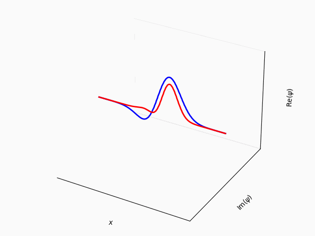

# Simulations of Common Physical Systems

**This is a work in progress**

## Requirements
- Python version 3.11.0 or above

## Roadmap
- Migrate to using DearPyGui show simulations

## Classical Double Pendulum
Analytic solution from Euler-Lagrange equations using canonical coordinates.

## 1-D Quantum Harmonic Oscillator 
A superposition of first two excited states.
Probability density (norm squared) is shown in red, wavefunction (psi) is shown in blue.

